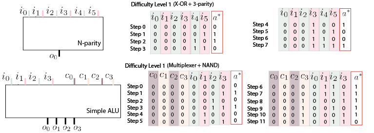

# Stepping gates

Stepping gates is a reinforcement learning benchmark designed to test the transfer 
learning abilities of agents, in particular their ability to find modular, hierarchical solutions.
The tasks consist in simulating the behavior of digital circuits, each task defining its own logical
operations. Each task consists of multiple levels and the user can choose to run 
them in three different modes: 

* without curriculum: the current episode requires solving the task of the final level
* with curriculum: the task starts with the first level and, once the agent solves it, moves to the next one. There's two ways to implement the curriculum:
  * only-n: the current episode requires solving only the task of the final level
  * up-to-n: the current episode requires solving the tasks of the current level and all previous levels leading to it


There's two tasks currently:

## N-parity
The agent needs to compute the parity of N bits. There are N-1 levels of difficulty, where the first level requires computing the parity of two bits (X-OR), each level adding an extra bit. The agent can move to the next level only when it has solved the current one and, at any level, needs to stuff all levels leading up to it.


## Simple ALU
The agent needs to simulate a simplified version of an Arithmetic Logical Unit that has the ability to switch between 16 logical operations using 4 control bits.
These operations follow an increasing difficulty: multiplexer, NAND, NOT, AND, XOR, XAX, increment by one, decrement by one and logical shift left.



* Illustration of the two tasks (top) N-parity is a task with N input bits and 1 output bit where the first level starts with two action-bits and each next level adds a bit. In this example with a task of 6 bits at level 1, a full episode will go through all 8 combinations of the 3 active bits. Inactive bits are set to 0 and the optimal action for each step is depicted inside the red rectangle  
     (bottom) the Simple ALU task has 4 control bits, 4 inputs, and 4 output bits. The episode length and number of active inputs depend on the current level. At level 1, the agent needs to solve the Multiplexer and NAND gates. A single control bit is used to switch between these two different gates*


The tasks can be run in two modes:

* all-steps: An episode lasts for multiple steps, moving through all possible combinations of the inputs. For example if the task is n-parity and the level is 2, then the episode will last for 8 steps as there are 3 input bits
* single-step: Here an episode lasts a single step, sampled randomly among all possible steps of the current level. This is useful for testing RL algorithms. 

## How to run

To install all package requirements you can run

```
pip install requirements.txt
```

For examples of how to run the different tasks see [this examples script][scripts/play.py]

